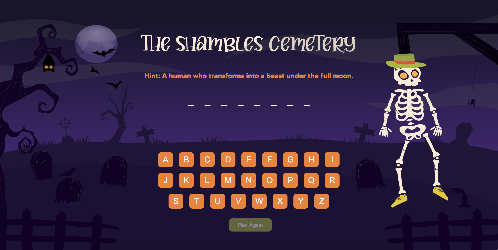

# The Shambles Cemetery - Project 1

## About the Game
The Shambles Cemetery is a classic Hangman game where players guess letters to match the length of the word. Hints are provided, and a theme adds to the experience. Players have 7 wrong attempts before losing the game, with each wrong guess gradually revealing parts of the hangman.

## Concept
#### -The Thought Process
As the developer of the game. I took inspiration from my trip to the UK in 2023. 2 cities have been part of my inspiration: York and Edinbrugh. As the concept of the cemetery goes back to the Greyfriars Kirkyard in Edinbrugh. The spookiness and the name (Shambles) goes back to the Shambles Street in York city which is known to be the most ghosted part of the UK. 

#### -Theme and Target Audience 
The theme is fun, colorful, and spooky because it targets 9-13 years old geeky kids who are interested in brain games. 

#### -Game Concept
The main idea behind the Hangman Game is to make it more exciting by creating a concept for it. The Shambles Cemetery is a ghosted cemetery with the Alchemist sealed inside his grave (The Hangman), as a player their mission is to guess the right letters before the Alchemist rises from his grave as its been mentioned in the instruction on the cover page. 

#### -How to Play
1. Read the hint and try to guess the right letters of the word.
2. Click on the guessed letters until the word display is full to win the game. 
3. Hit play again to guess more words. 

## Planning Materials 
[Planning Document](https://trello.com/invite/b/673dbfb412ac2aaf586e0fb3/ATTIe5e3927247206399249d89414565e2569D255CE1/ga-project-1-planning-hangman-game)

## Acknowledgement 
**-Fonts**
+ Display Typeface: [Buttery](https://fontbundles.net/free-fonts/regular-fonts/buttery-a-quirky-all-caps-serif-font)
+ Body Typeface: [Made Tommy](https://www.dafont.com/made-tommy.font)

**-Sound Effects**
+ [Pixabay](https://pixabay.com/sound-effects/search/spooky/)
+ [Uppbeat](https://uppbeat.io/browse/sfx/gaming)
+ [Mixkit](https://mixkit.co/free-sound-effects/game/)

## Future Enhancement  
The game aspire to be developed in a more complex series to make the players engage more with it. For example:
+ **Animation:** The game will be more dynamic since people tend to be engaged with visual animacy.
+ **Levels:** Players love the challenge, and providing it will stimulate their desire to play.
+ **Multiple players:** To make it more active, multiple players can play at the same time and can guess the same words. Whoever guess it first will get points and their ranking will go up and win the game. 
+ **Series:** Long term goal-the game will be called **The Shambles Street of Ghosts** and it will be a series of brain games not just *Hangman*. Hangman will be the first level and if the player passed the first level they will move to the next level. A digital escape room. 

## Technology Used
+ 
+ 
+ 

## Deployed Link 
[The Shambles Cemetery](https://lulwa01.github.io/hangman-game-project/)